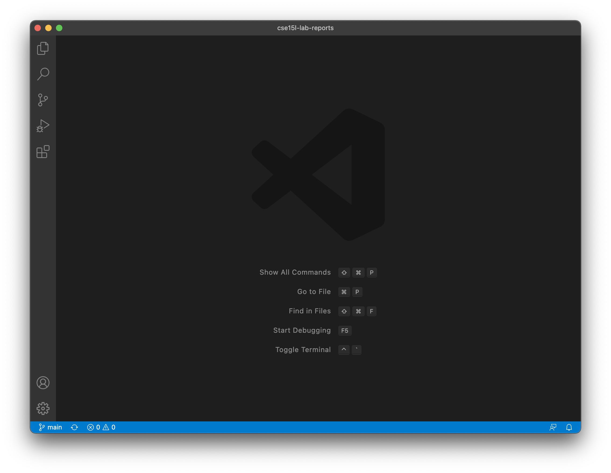
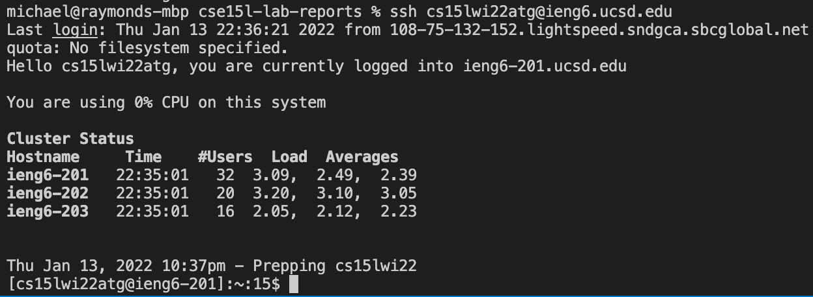
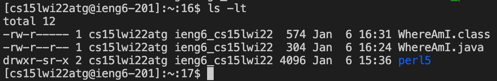
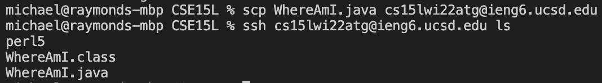
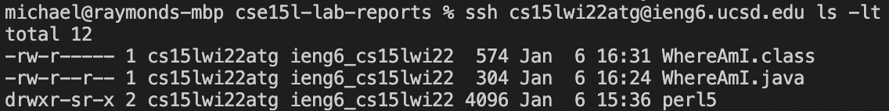
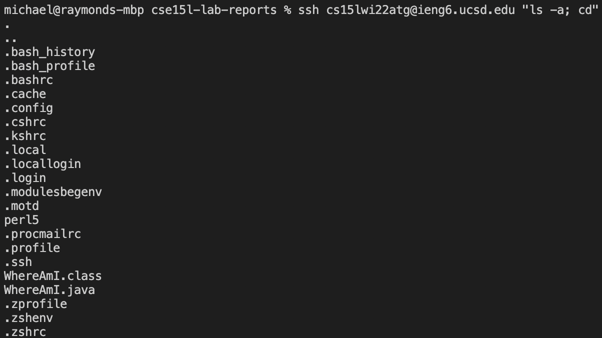

Go to [Lab Report 2 (Week 4)](lab-report2.md)

# Lab Report 1 (Week 2)

**TUTORIAL: *LOGGING INTO A COURSE-SPECIFIC ACCOUNT ON IENG6***  
Michael Chan  
01-13-2022  
  
**Step 1: Installing VScode**  
* download VScode [here](http://code.visualstudio.com)  
* pressing the app should open a window like this:  
  

  
**Step 2: Remotely Connecting**  
* open a new terminal in VScode (terminal > new terminal)  
* enter this command: `ssh courseSpecificAccount` (see below)  

  

**Step 3: Trying Some Commands**  
* possible commands to run: `ls`, `ls -a`,`cd ~`, `cp`, `cat`
* note: ~ is home; use `man` to see user manual of any command; ctr+C to quit command, ctrl+D to exit ieng6

  
  
**Step 4: Moving Files With `scp`**  
* `scp` means secure copy; run on client to copy files to ieng6 server  
* enter this command: `scp file(s) courseSpecificAccount:path` (see below)  

  
  
**Step 5: Setting An SSH Key**  
* to bypass the password prompt when interacting with a remote server, use `ssh` keys
* enter command: `ssh-keygen` to generate a public/private key pair, then save key in the file `/Users/name/.ssh/id_rs`  
* enter command: `scp /Users/name/.ssh/id_rsa.pub account:~/.ssh/authorized_keys` to copy public key to the .ssh directory on server  
* ssh and scp should no longer require a password (see below)

  
  
**Step 6: Optimizing Remote Running**  
* connect to server, run commands, and log out in a single line: `ssh account "command(s)"`
* run multiple commands on the same line by separating with a semicolon  
* use quotes to run all commands on the remote server instead of just the first one  

