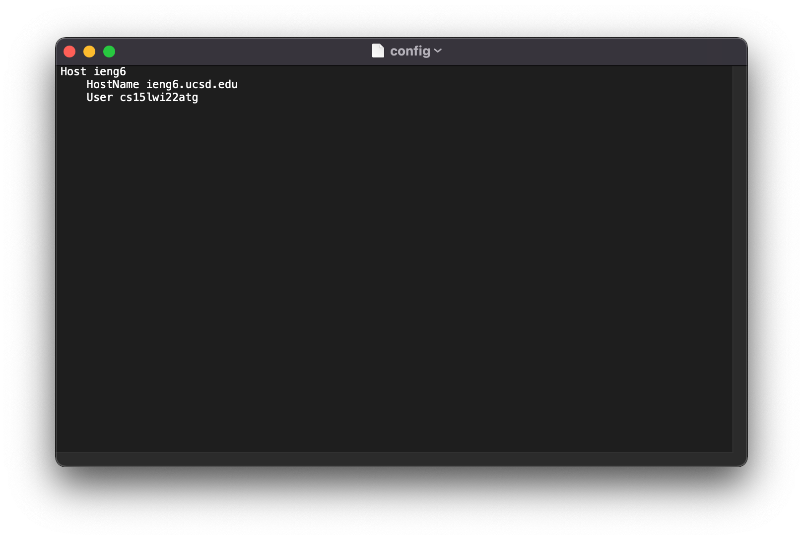
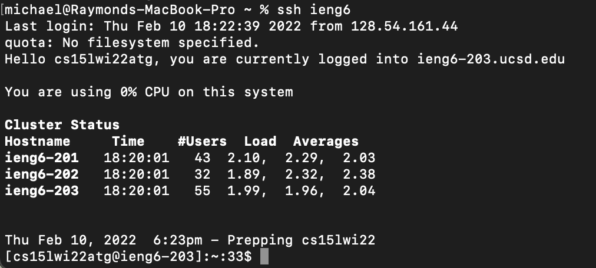
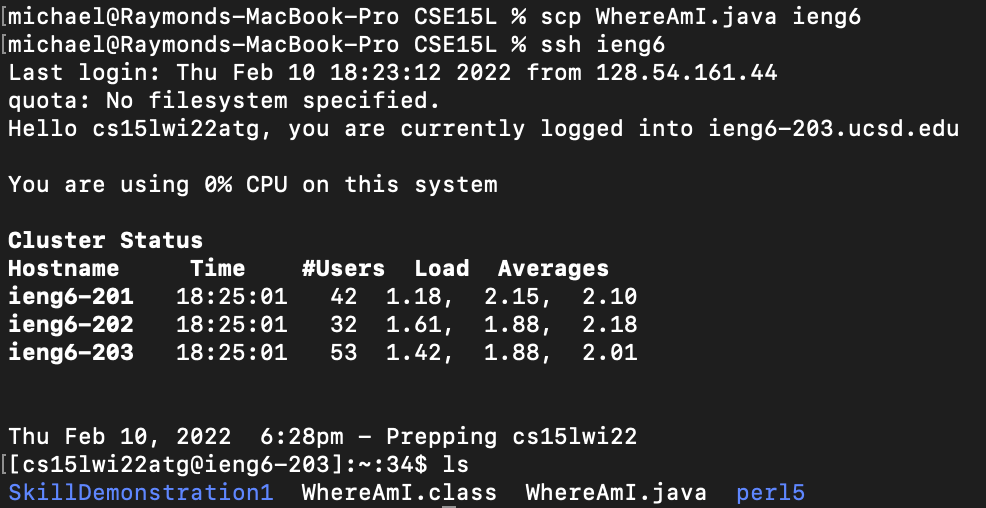

# Lab Report 3 - Streamlining ssh Configuration   

Michael Chan     
02-11-2022   
 
To streamline the login process onto the ieng6 server from my laptop, I started by creating a config file in the ssh directory with `touch config`. Then I opened `~/ssh/config` in the default editor with `open -t config` and added the following lines:
 

 
Now I can log into my CSE15L account just by using the alias above. The command `ssh cs15lwi22atg@ieng6.ucsd.edu` is shortened to `ssh ieng6`.   
 

    
`ieng6` is interpreted as `cs15lwi22atg@ieng6.ucsd.edu` for other commands, too. Here I used `scp` to copy the file `WhereAmI.java` to my account with the new alias.
    

