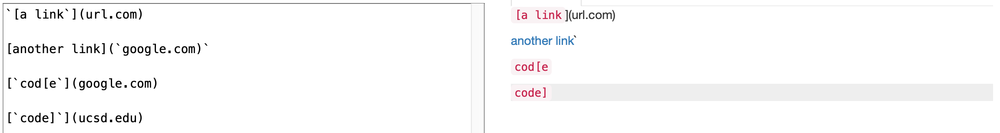
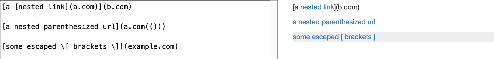
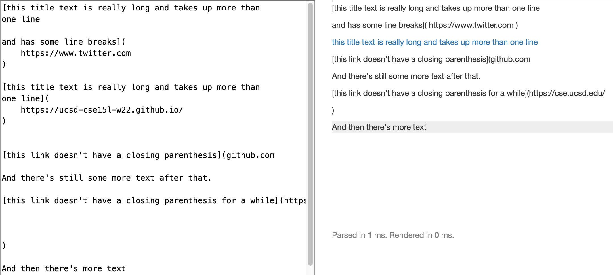
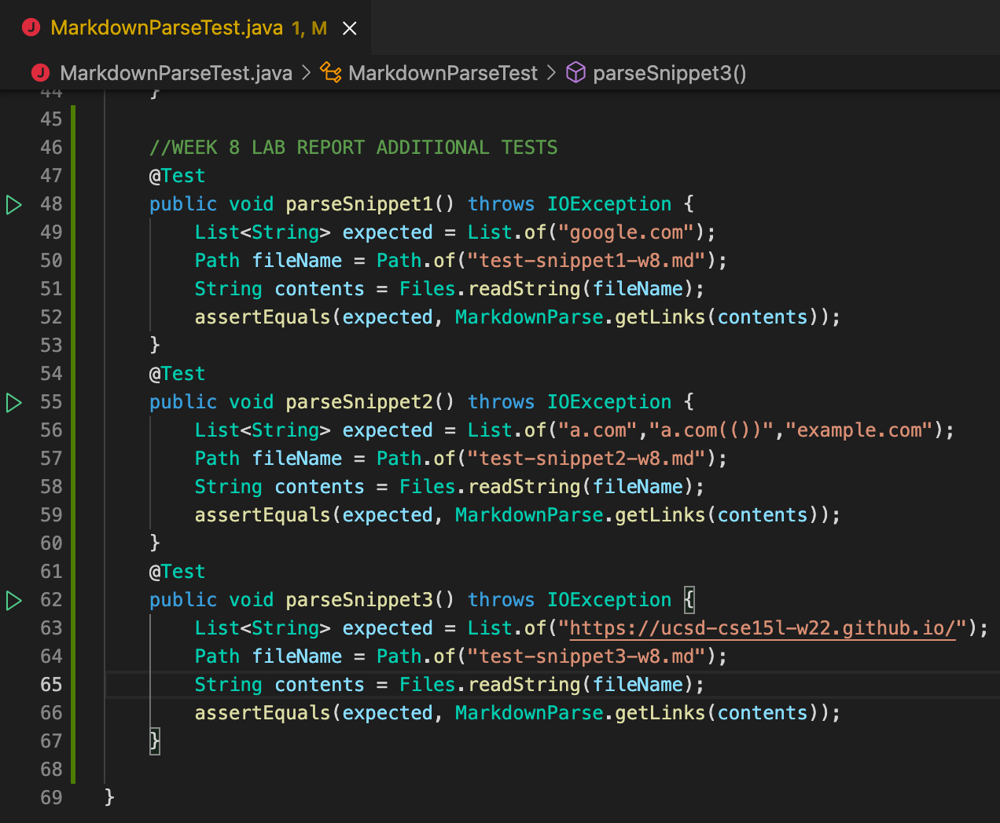
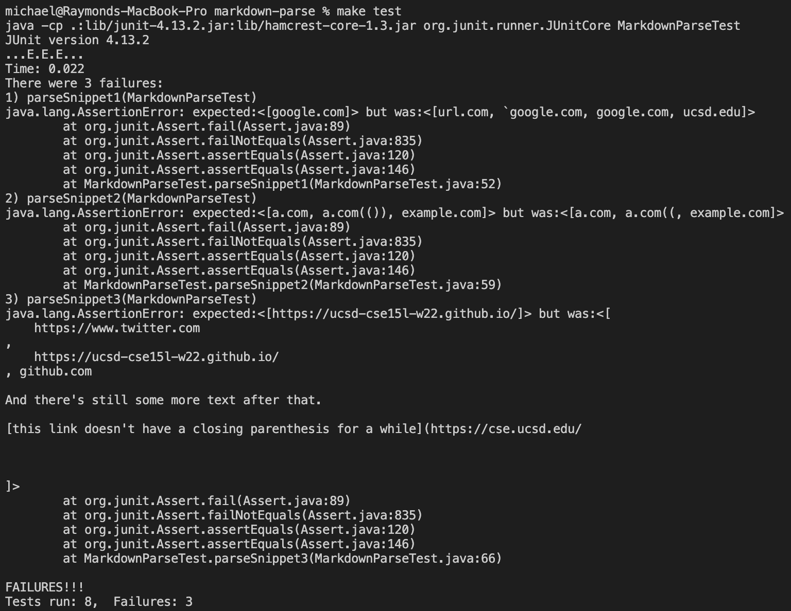
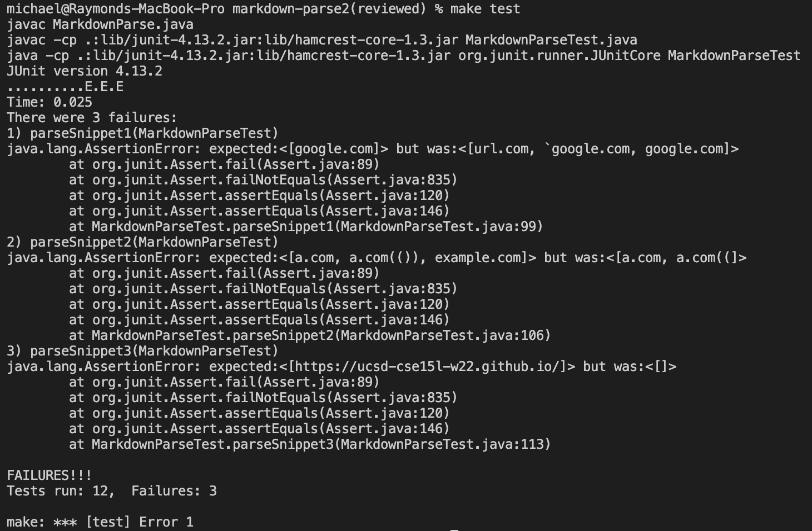

# Lab Report 4 - Testing Markdown Snippets   

Michael Chan     
02-25-2022   
 
**Repository Links**   
[Michael C (mine)](https://github.com/michaelchan77/markdown-parse)   
[Ben X (reviewed)](https://github.com/BenX-64/markdown-parse)   
 
**Expected Output from CommonMark**   
Snippet 1   
   

Snippet 2   
   

Snippet 3   
   

 
**Tests**   
I created three new test files containing Snippets 1-3 respectively, then inserted the following code into MarkdownParseTest.java for both implementations.   

 
**Output**   
Running the tests with my implementation:
   
Running the tests with the implementation I reviewed:
   
 
**Follow-up Questions**
* Snippet 1:   
I do not think my current implementation can be changed slightly to accomodate all cases that use inline code with back ticks. Each back tick needs to be checked with its matching back tick in parallel with the checks for `[]` and `()` delimiters, and in cases of overlap each operator must be assigned a relative priority. A more involved change from the current code would be required.
* Snippet 2:   
Likewise, a more involved change would be needed to make my program work for all cases that contain nested parentheses and brackets. The code currently calculates the index of the next closed delimiter under the assumption that there is only one matching set per link. A separate helper method that finds the matching closed delimiter in the file for a given open one would be needed to accomodate those cases.
* Snippet 3:   
There is a small code change that will make my program work for cases with newlines in brackets and parentheses. The program is expected to correctly parse links with non-adjacent newlines inside the `[]` or up to one newline at the ends of (but not within) the link inside the `()`, which can be achieved with a while loop that trims the inputted file of newlines accordingly before the links are extracted.