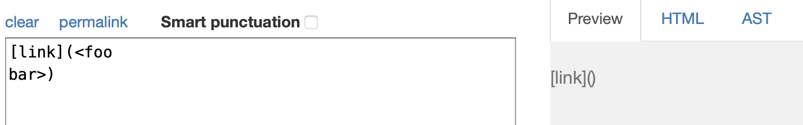
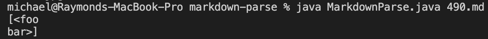
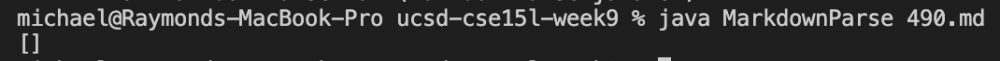
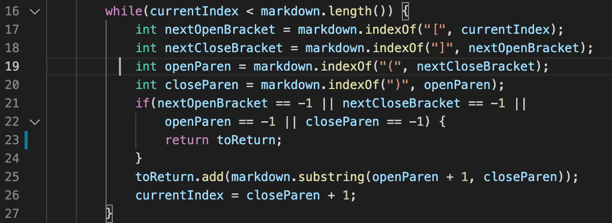
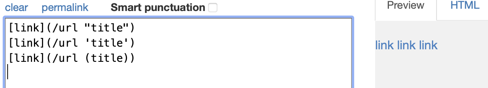
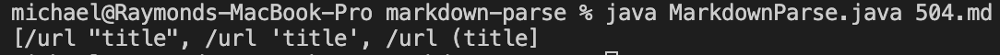
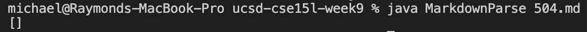
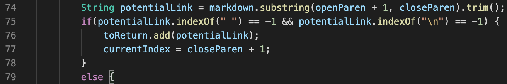

# Lab Report 5 - Comparing Test Results  

Michael Chan     
03-10-2022   
    

**Finding Tests**   
I searched through the test files folder manually to find interesting cases where I imagined my code would fail. Then I ran those selected test files on both implementations to see if the results differed and found that they did on tests #490 and #504.   
  

**Test #490**   
Expected output:   
   
My implementation's output: 
   
Provided implementation's output:   
   
   
The provided implementation returned the expected empty list but my implementation produced the wrong output. The contents in the parentheses should not produce a link because of the newline in the middle of the text. To fix the bug, an if-statement should be inserted before line 25 to the code below that checks whether markdown contains a `\n` before adding it to `toReturn`.
   
  

**Test #504**   
Expected output:   
  
My implementation's output: 
  
Provided implementation's output:   
  
   
Both implementations produced the wrong output. The provided implementation returned an empty list while mine returned an almost-correct list with a missing `)`. To fix the output for the provided implementation, line 73 in the code below would need to be removed or fixed to recognize contents of the form `/url (link)` and ignore the space in that case.
  

