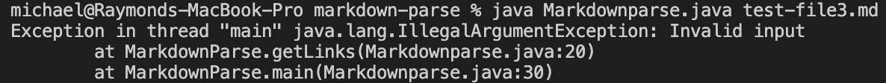

# Lab Report 2 (Week 4)   

Michael Chan     
01-27-2022   
 
**Code Change #1**  

   

Failure-inducing input: [(test-file2.md)](test-file2.md)

Symptom:
  
 
The failure-inducing input replaced a "]" with a ")", which caused a bug where the while loop condition in getLinks() was never fulfilled. The symptom was an infinite loop, meaning nothing printed to the terminal. The fix allows the function to break out of the while loop when indices of "" aren't found in the file.   
 
**Code Change #2**  

   

Failure-inducing input: [(test-file2.md)](test-file2.md)

Symptom:
  
 
The failure-inducing input is the same. After the previous fix, the code now exits the loop successfully and prints an "Invalid input" statement, but it has another symptom of printing a link afterwards because of a bug where `toReturn` is still returned after `break`. To fix this, `break` was replaced with throwing an exception with an "Invalid input" message.      
 
**Code Change #3:**  

   

Failure-inducing input: [(test-file3.md)](test-file3.md)

Symptom:
  
 
The failure-inducing input is a file with text and no links that should return an empty list. However, the previous fix has caused a bug where an exception will be thrown even when it shouldn't be. The symptom is an exception message in the terminal. To fix the issue, a clause was added in the beginning of the getLinks method that checks if the file contains only text.   

